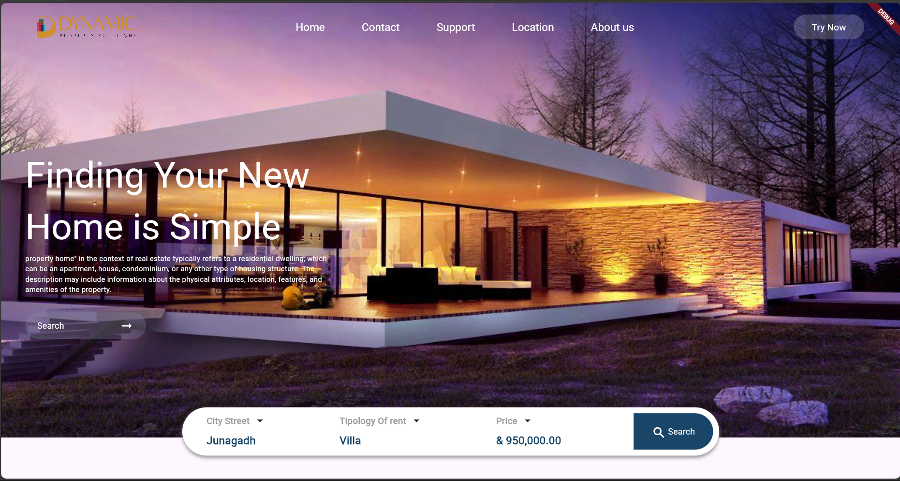
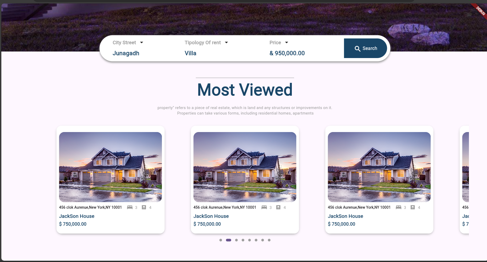
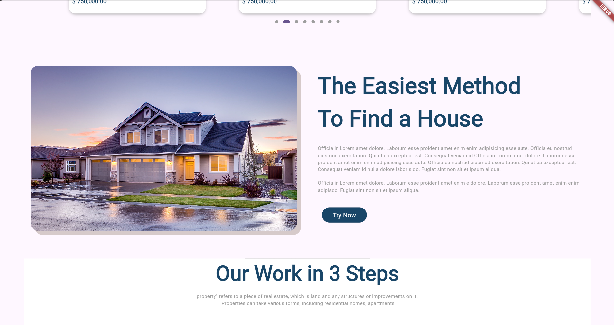
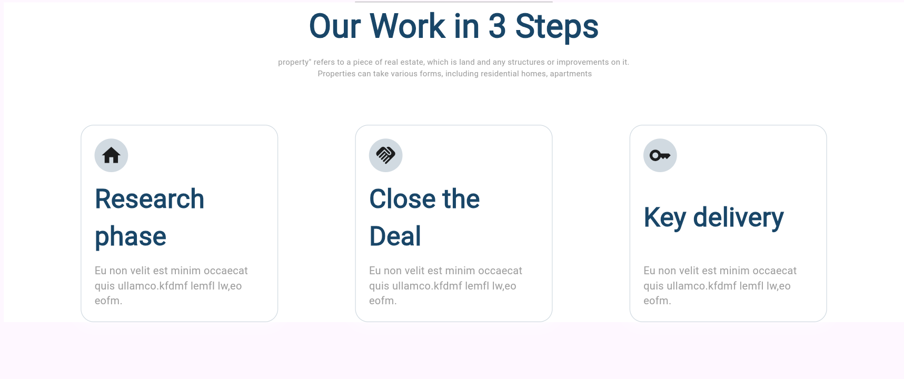
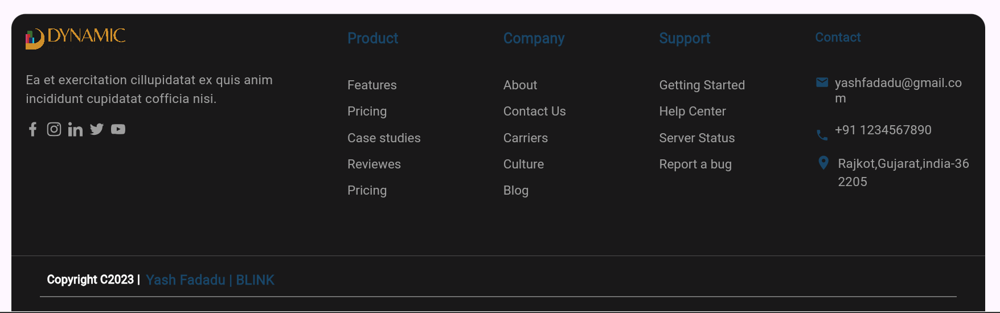

# Property-Flutter-LandingPage
 This is the Repo for flutter web project(Property LandingPage)
# 🏠 Property Landing Page

Welcome to the **Property Landing Page** Flutter project! This single-screen application showcases a property listing with a clean and modern design.

## 📸 Screenshots

Check out the stunning design of the landing page:

## Screenshots

Here are some screenshots of the application:

|  |  |  |
|--------------------------------------|--------------------------------------|--------------------------------------|
|  |  |  |


*Add more images if needed in the `images` directory.*

## 🚀 Getting Started

To get this project up and running on your local machine, follow these steps:

### 1. Clone the Repository

```bash
git clone https://github.com/yourusername/property-landing-page.git
cd property-landing-page
```

### 1. Download Flutter Packages

```bash
flutter pub get
```

### 2. Run the Application

```bash
flutter run
```

## 📝 License

This project is licensed under the MIT License - see the [LICENSE](LICENSE) file for details.

## 📝 Authors

* **YASH FADADU** - *Initial work* - [Your Profile](https://github.com/yash-1994)
